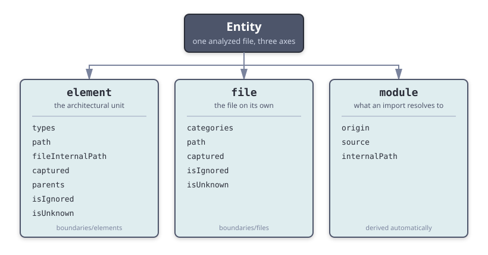
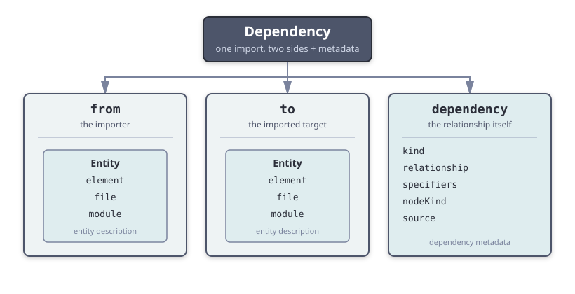

# Classification

Before the plugin can enforce a rule, it has to answer two questions: *what is this file?* and *what is this dependency?*

## What is this file?

It answers the first — *what is this file?* — through three independent layers. Every file is described by all three at once:

- **Element** — the architectural piece the file belongs to, such as the folder `components/Button/` or `helpers/data/`. **You define elements** with [element descriptors](./elements.md).
- **File** — the file on its own, regardless of which element it lives in. **You define file categories** with [file descriptors](./files.md).
- **Module** — what an import resolves to: a local file, an external package, or a Node.js built-in. **This layer is derived automatically** from the import; you do not configure it (except for the [optional `boundaries/flag-as-external` and `boundaries/root-path` settings](../settings/settings.md)).

Together these three layers form an **entity** — the unit the plugin analyzes. The layers are orthogonal: the same file can be element-type `["component"]`, file-categories `["test", "tsx"]`, and module-origin `"local"`, all independently.

## What is this dependency?

It answers the second — *what is this dependency?* — by combining two entities with a third, fully computed layer:

- **`from`** — the **entity** of the importer (the file being analyzed).
- **`to`** — the **entity** of the imported target.
- **`dependency`** — **dependency metadata**: information about the nature of the relationship itself, such as its `kind`, the `relationship` between the two elements, and the imported `specifiers`. Unlike the three entity layers, **this layer is entirely computed** from the import; you never configure it.

Together, `from`, `to`, and `dependency` form a **dependency description** — the unit a [policy](../policies/policies.mdx) evaluates.

This page is organized around these two units. The **[Entity](#entity)** section covers the three layers that describe a single file; the **[Dependency](#dependency)** section covers how two entities and the dependency metadata describe one import. Each layer also has its own page with the full reference.

## Entity

An **entity** is the unit the plugin analyzes — one file described along three independent axes: its [element](./elements.md), its [file](./files.md) classification, and the [module](./modules.md) it resolves to.



The three layers are orthogonal, so the same file can be classified independently on each axis. The sections below introduce each layer; each has its own page with the full reference.

### The element layer

An element is a group of files the plugin treats as one architectural unit — usually a folder. You declare elements in the `boundaries/elements` setting, assigning each a `type` and a `pattern` that matches its files. The plugin can also capture path fragments (a component's name, a helper's family) for use in rules.

Define your `helper`, `component`, and `module` elements, then write rule policies about which may depend on which.

```js
"boundaries/elements": [
  { type: "helper", pattern: "helpers/*", capture: ["family"] },
  { type: "component", pattern: "components/*/*", capture: ["family", "elementName"] },
  { type: "module", pattern: "modules/*", capture: ["elementName"] }
]
```

:::info
Read **[Elements](./elements.md)** for descriptor properties, matching order, hierarchical elements, and multi-type elements.
:::

### The file layer

The file layer answers a different question than the element layer: not *which element does this file belong to?* but *what kind of file is this, on its own?* You declare file categories in the `boundaries/files` setting. A file descriptor assigns a `category` to every file matching its `pattern`.

This layer is for cross-cutting file kinds — tests, styles, stories — that appear inside many different elements. Categories accumulate, so one file can carry several at once. Like element descriptors, file descriptors can also `capture` named path fragments for use in rule policies, exposed at runtime as `file.captured`.

```js
"boundaries/files": [
  { pattern: "**/*.spec.js", category: "test" },
  { pattern: "**/*.css", category: "style" }
]
```

:::info
Read **[Files](./files.md)** for file descriptor properties, how categories accumulate, and the migration from the deprecated element-level `category`.
:::

### The module layer

The module layer describes where a dependency resolves to. Unlike the other two, you do not configure it — the plugin derives it from each import. A module has an `origin` of `"local"` (your own project), `"external"` (an installed package), or `"core"` (a Node.js built-in), plus a `source` (the base package name) and an `internalPath` (the sub-path within a package).

This is the layer you use to control imports of packages and built-ins: allow only certain elements to import `react`, or forbid direct imports of Node.js core modules.

```text
import "react"        → { origin: "external", source: "react",  internalPath: null }
import "node:fs"      → { origin: "core",     source: "node:fs", internalPath: null }
import "../helpers"   → { origin: "local",    source: null,      internalPath: null }
```

:::note
You can also use the `boundaries/flag-as-external` and `boundaries/root-path` settings to influence how the plugin determines the origin of local files, which may be useful in monorepo setups. See **[Modules](./modules.md)** for details.
:::

:::info
Read **[Modules](./modules.md)** for the origin determination rules and how `boundaries/flag-as-external` and `boundaries/root-path` influence them.
:::

### Which layer should I use?

The three layers are independent, so the right one depends on the question you are asking.

:::tip
You rarely use a single layer in isolation. A typical policy combines them: *components may import test files only from helpers*, for example, mixes the element layer with the file layer.
:::

| You want to… | Use | Configured with |
| --- | --- | --- |
| Group code by architectural role (components, helpers, modules) | Elements | [`boundaries/elements`](./elements.md) |
| Tag files across elements (tests, styles, stories) | File categories | [`boundaries/files`](./files.md) |
| Control imports of external packages or Node.js core modules | Modules | derived automatically; see [Modules](./modules.md) |
| Capture path fragments (element name, family) for dynamic policies | Element or file captured values | [`boundaries/elements`](./elements.md) / [`boundaries/files`](./files.md) |

For the full property list of each layer, see the per-layer reference tables:

- [Element description](./elements.md#element-description) — `types`, `path`, `fileInternalPath`, `captured`, `parents`, and the element states.
- [File description](./files.md#file-description) — `categories`, `path`, `captured`, and the file states.
- [Module description](./modules.md#module-description) — `origin`, `source`, `internalPath`.

## Dependency

When the plugin analyzes a dependency, it builds a runtime **dependency description** that links two entities through the dependency metadata:



- `from`: the **entity** of the file being analyzed (the importer).
- `to`: the **entity** of the imported target.
- `dependency`: **dependency metadata** about the relationship itself (`kind`, `relationship`, `specifiers`, and so on — see [Dependency metadata](#dependency-metadata) below).

Both `from` and `to` are entities, so each exposes all three layers. Here is the full shape for a single dependency, annotated by layer:

```js
{
  // The importer (a known element; an unknown file, since no file descriptor matches AtomA.js)
  from: {
    element: { types: ["component"], path: "components/atoms/atom-a", captured: { family: "atoms", elementName: "atom-a" }, /* ... */ },
    file:    { categories: null, isUnknown: true, path: "components/atoms/atom-a/AtomA.js", /* ... */ },
    module:  { origin: "local", source: null, internalPath: null }
  },
  // The imported target
  to: {
    element: { type: null, isUnknown: true, /* ... */ },
    file:    { categories: null, isUnknown: true, /* ... */ },
    module:  { origin: "external", source: "react", internalPath: null }
  },
  // The relationship between them (null here, since the target is not a known local element)
  dependency: { kind: "value", source: "react", relationship: { from: null, to: null }, /* ... */ }
}
```

Notice how the two entities lean on different layers. The local importer is a known `element` (its `file` is unknown here only because no file descriptor matches `AtomA.js`); the imported package is unknown as an element and a file, and meaningful only in its `module`. This is why you match local files with element and file selectors, and match packages with module selectors.

:::note
A file can be a **known element** and an **unknown file** at the same time — the layers are independent. A file is "known" to the file layer only when it matches a [file descriptor](./files.md).
:::

[Selectors](../selectors/selectors.md) match against these descriptions; [message templates](../policies/policies.mdx#message-templating) read from them to render dynamic error messages.

### Dependency metadata

The `dependency` part of a dependency description carries metadata about the relationship itself — independent of the two entities it connects. Unlike the three entity layers, it is **entirely computed** from the import: it describes the nature of the dependency, such as its `kind` (a value, type, or typeof import), the `relationship` between the two elements (`child`, `sibling`, `parent`…), the imported `specifiers`, the AST `nodeKind` that produced it, and the literal `source` written in the code.

Read **[Dependency](./dependency.md)** for the full property list of the dependency metadata description.

## Combining layers in a policy

The layers pay off when you combine them. Say you want components to import test files only from helpers. That policy mixes the element layer (the importing element and the target element) with the file layer (the target file's category):

```js
{
  from: { element: { type: "component" } },
  allow: {
    to: {
      element: { type: "helper" },
      file: { categories: "test" },
      module: { origin: "local" }
    },
    dependency: { kind: "value" }
  }
}
```

The `from`/`to` objects above are **entity selectors**: each sub-key (`element`, `file`, `module`, `dependency`) matches its own layer, and all provided sub-keys must match. Read **[Selectors](../selectors/selectors.md)** for the full matching reference, and **[Policies](../policies/policies.mdx)** for how policies use these selectors to allow or disallow dependencies.

## Next Steps

- **[Elements](./elements.md)** - define the architectural elements your files belong to.
- **[Files](./files.md)** - categorize files across elements with file descriptors.
- **[Modules](./modules.md)** - understand module origin for external and core imports.
- **[Dependency](./dependency.md)** - read the computed dependency metadata that describes each import.
- **[Selectors](../selectors/selectors.md)** - match elements, files, and modules in your policies.
- **[Policies](../policies/policies.mdx)** - write the dependency rule policies that enforce your architecture.
- **[Debugging](../guides/debugging.md)** - inspect the runtime entity description the plugin assigns to each file.
