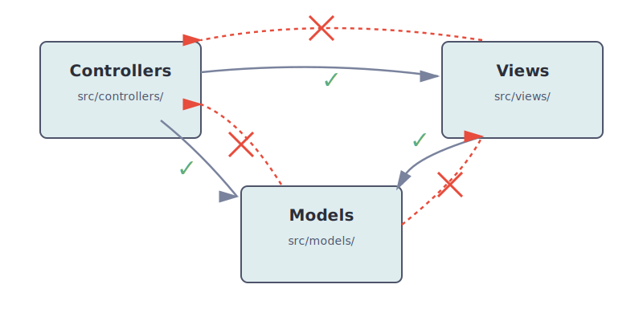

# Overview

JSBoundaries is a project that provides a set of tools to help you enforce architectural boundaries in your JavaScript and TypeScript projects.

:::info Robert C. Martin's quote
**"Software architecture is the art of drawing lines that I call boundaries. Those boundaries separate software elements from one another, and restrict those on one side from knowing about those on the other."**

[*Clean Architecture: A Craftsman's Guide to Software Structure and Design*](https://www.oreilly.com/library/view/clean-architecture-a/9780134494272/)
:::

At the moment, it consists of an ESLint plugin: [eslint-plugin-boundaries](https://www.npmjs.com/package/eslint-plugin-boundaries): It ensures that __your architectural boundaries are respected by the elements in your project__ by checking the folder and file structure and the dependencies between them.

By default, it analyzes `import` statements, but it can also evaluate `require`, `exports` and dynamic imports. You can also configure it to inspect any other AST nodes. See the [configuration guide for more details](./setup/settings.md).

<div style={{textAlign: 'center', margin: '2rem 0'}}>
  
</div>

```javascript
const rules = [
  {
    from: "controllers",
    allow: ["models", "views"]
  },
  {
    from: "views",
    allow: ["models"]
  }
];
```

:::note
This plugin is not a replacement for [eslint-plugin-import](https://www.npmjs.com/package/eslint-plugin-import). In fact, using both together is recommended.
:::


