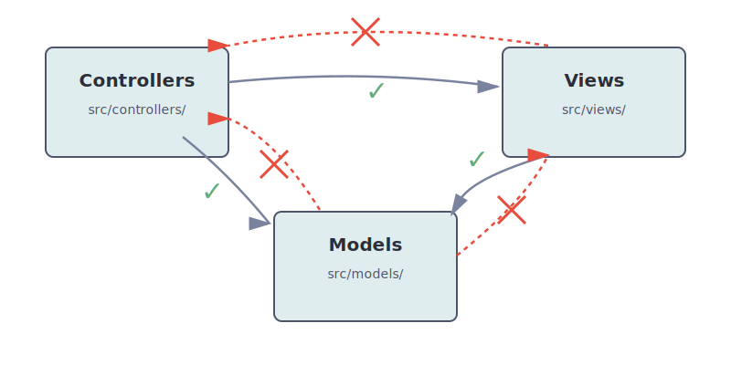

# Overview

JS Boundaries is a project that provides a set of tools to help you enforce architectural boundaries in your JavaScript and TypeScript projects.

---

:::info Robert C. Martin's quote
**"Software architecture is the art of drawing lines that I call boundaries. Those boundaries separate software elements from one another, and restrict those on one side from knowing about those on the other."**

[*Clean Architecture: A Craftsman's Guide to Software Structure and Design*](https://www.oreilly.com/library/view/clean-architecture-a/9780134494272/)
:::

---

At the moment, it consists of an ESLint plugin: [eslint-plugin-boundaries](https://www.npmjs.com/package/eslint-plugin-boundaries): It ensures that __your architectural boundaries are respected by the elements in your project__ by checking the folder and file structure and the dependencies between them.

By default, it analyzes `import` statements, but it can also evaluate `require`, `exports` and dynamic imports (`import()`). You can further customize it to inspect any other AST node that creates a dependency, such as `jest.mock()`. See the [configuration guide for more details](./setup/settings.md).

## 1. Define the Elements in Your Project through Configuration

```javascript
const elementDescriptors = [
  { type: "controllers", pattern: "controllers/*" },
  { type: "models", pattern: "models/*" },
  { type: "views", pattern: "views/*" },
  { type: "shared", pattern: "shared/*" },
];
```

## 2. The Plugin Provides Descriptions for Each Dependency

Given this configuration, the plugin will analyze your project in runtime and classify dependencies, providing lots of useful metadata about the elements and their relationships. For example:

```javascript
// When analyzing src/controllers/controller-a.js
{
  from: {
    path: "src/controllers/controller-a.js",
    type: "controllers",
    category: null,
    captured: { elementName: "controller-a" },
    origin: "local",
  },
  to: {
    path: "src/views/view-a.js",
    type: "views",
    category: null,
    captured: { elementName: "view-a" },
    origin: "local",
    source: "@views/view-a.js",
  },
  dependency: {
    kind: "value",
    source: "@views/view-a.js",
    specifiers: ["ViewA"],
  }
}
```

## 3. Define your Rules Based on These Descriptions

Based on these descriptions, you can define rules to allow or disallow dependencies between elements. For example:

<div style={{textAlign: 'center', margin: '2rem 0'}}>
  
</div>

```javascript
const dependencyRules = [
  {
    from: {
      type: "controllers",
    },
    dependency: {
      kind: "value",
    },
    allow: [{
      type: ["models", "views"],
    }],
  },
  {
    from: {
      type: "views",
    },
    allow: [{
      type: "models",
    }]
  },
  {
    from: {
      type: "models",
    },
    disallow: [{
      type: "!models",
    }],
  },
  {
    from: {
      type: "*",
    },
    allow: [
      {
        type: "*",
      },
    ],
    dependency: {
      relationship: {
        to: "internal",
      },
    },
  },
  {
    from: {
      type: "*",
    },
    allow: [
      {
        type: "shared",
      },
    ],
    dependency: {
      kind: "type",
    },
  },
];
```

## 3. Get Instant Feedback

When a file violates a dependencies rule, ESLint will report an error:

```javascript
// In src/models/model-a.js

import View  from '../views/view-a'; /* ❌ Error: Importing elements of type
'views' is not allowed in elements of type 'models'. Disallowed in rule 3 */
```

## Scope

This plugin focuses on enforcing architectural boundaries by analyzing the relationships between abstract elements. It does not inspect import syntax or enforce coding standards unrelated to module dependencies.

:::note
This plugin is not a replacement for [eslint-plugin-import](https://www.npmjs.com/package/eslint-plugin-import). In fact, using both together is recommended.
:::

## Quick Start

:::tip
Read the [Quick Start Guide](./quick-start.mdx) for step-by-step instructions on setting up the plugin in your project.
:::

