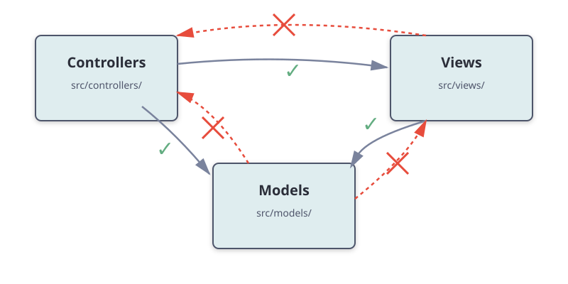

# Overview

JS Boundaries is a project that provides a set of tools to help you enforce architectural boundaries in your JavaScript and TypeScript projects.

---

:::info[Robert C. Martin's quote]
**"Software architecture is the art of drawing lines that I call boundaries. Those boundaries separate software elements from one another, and restrict those on one side from knowing about those on the other."**

[*Clean Architecture: A Craftsman's Guide to Software Structure and Design*](https://www.oreilly.com/library/view/clean-architecture-a/9780134494272/)
:::

---

## Purpose

It ensures that __your architectural boundaries are respected by the elements in your project__ by checking the folder and file structure and the dependencies between them. At the moment, it consists of an **ESLint plugin: [eslint-plugin-boundaries](https://www.npmjs.com/package/eslint-plugin-boundaries).**

## How It Works

By default, it analyzes `import` and `export` statements, `require` calls, and dynamic `import()` expressions. You can customize it to inspect any other AST node that creates a dependency, such as `jest.mock()`. See the [configuration guide for more details](./setup/settings.md).

For each dependency it finds, the plugin classifies both the file the dependency comes from and the module it points to. That classification is what your rules read to decide whether the dependency is allowed.

## The Three Classification Layers

The plugin classifies every file along three independent layers — and, for each dependency, the module it resolves to. You configure the first two; the third is derived for you. Rules then combine any of them to draw a boundary.

| Layer | Describes | You configure? | Example |
| --- | --- | --- | --- |
| **element** | The architectural role a file plays. Usually based on the folder it is in. | Yes, with [element descriptors](./setup/elements.md). | `{ type: "controller", pattern: "controllers/*" }` |
| **file** | A cross-cutting category of the file itself, independent of its element. | Yes, with [file descriptors](./setup/files.md). | `{ pattern: "**/*.spec.js", category: "test" }` |
| **module** | Where the imported module resolves from. | No — derived from the import. | `import "react"` resolves to `module.origin: "external"` |

- An **element** is a group of files the plugin treats as one architectural unit — always a folder, like `controllers/*`. Element patterns match folder paths; they should not include file extensions. You map paths to a `type`, and every file under that folder belongs to that element.
- A **file** category is a label attached to the file on its own, such as `"test"` or `"style"`. File patterns can match individual files (e.g. `**/*.spec.js`). A file is independent of the element: the same file can be a controller *and* a test.
- A **module** is the resolved target of a dependency. The plugin derives its [origin](./setup/modules.md) — `"local"` (your own files), `"external"` (a package), or `"core"` (a Node.js built-in) — so you can target third-party imports without naming each one.

Because the layers are independent, a rule can mix them. A few boundaries you can express, each phrased as an outcome and mapped to the selector fragment that captures it:

- **Models cannot import views** — `from: { element: { type: "model" } }`, `disallow: { to: { element: { type: "view" } } }`.
- **No code may import test files** — `disallow: { to: { file: { categories: "test" } } }`.
- **Only shared code may use the `axios` package** — `from: { element: { type: "!shared" } }`, `disallow: { to: { module: { source: "axios" } } }`.

:::tip
Layering is progressive. Start with one classification layer — elements or files — and one rule, then add the remaining layers when you need them. You only need to configure one of the two; the rest is optional. See [Classification](./setup/classification.md).
:::

## Usage

### 1. Define the Classification in Your Project through Configuration

Map paths to element types, tag files with categories, or both — you only need one of the two layers:

```javascript
const elementDescriptors = [
  { type: "controller", pattern: "controllers/*" },
  { type: "model", pattern: "models/*" },
  { type: "view", pattern: "views/*" },
  { type: "shared", pattern: "shared/*" },
];

const fileDescriptors = [
  { pattern: "**/*.spec.js", category: "test" },
];
```

### 2. The Plugin Builds a Runtime Description for Each Dependency

Given this configuration, the plugin analyzes your project at runtime and describes each dependency. For both sides of a dependency (`from` and `to`), it builds the three layers: the `element` the file belongs to, the `file` itself, and the resolved `module`. For example:

```javascript
// Runtime description for a dependency in src/controllers/controller-a/index.js
{
  from: {
    element: {
      types: ["controller"],
      captured: { elementName: "controller-a" },
    },
    file: { categories: null },
    module: { origin: "local" },
  },
  to: {
    element: {
      types: ["view"],
      captured: { elementName: "view-a" },
    },
    file: { categories: null },
    module: { origin: "local" },
  },
  dependency: {
    kind: "value",
    source: "@views/view-a",
    specifiers: ["ViewA"],
  },
}
```

:::tip
This is a simplified view. See **[Classification](./setup/classification.md)** for the full list of properties available in each description.
:::

### 3. Define your Rules Based on These Descriptions

Based on these **[descriptions](./setup/classification.md)**, you can define rules to allow or disallow dependencies using **[selectors](./setup/selectors.md)**. For example:

<div style={{textAlign: 'center', margin: '2rem 0'}}>
  
</div>

```javascript
const dependencyRules = [
  // Allow controllers to depend on models and views
  {
    from: { element: { type: "controller" } },
    allow: {
      to: { element: { type: ["model", "view"] } },
    },
  },
  // Allow views to depend on models
  {
    from: { element: { type: "view" } },
    allow: {
      to: { element: { type: "model" } },
    },
  },
  // Disallow models to depend on anything other than other models
  {
    from: { element: { type: "model" } },
    disallow: {
      to: { element: { type: "!model" } },
    },
  },
  // Disallow any element from importing a test file (a file layer match)
  {
    disallow: {
      to: { file: { categories: "test" } },
    },
  },
];
```

:::note
This is a very simplified view. See **[Selectors](./setup/selectors.md)** for the full syntax and capabilities of selectors, and **[Rules](./setup/rules.mdx)** for the full list of rule properties.
:::

### 4. Get Instant Feedback

When a file violates a dependencies rule, ESLint reports an error. For example, a model importing a view:

```javascript
// src/models/model-a/index.js
import View from "../../views/view-a";
```

ESLint reports:

```text
error  Dependencies to elements of type "view" are not allowed in elements of type "model". Denied by rule at index 2  boundaries/dependencies
```

## Scope

This plugin focuses on enforcing architectural boundaries by analyzing the relationships between abstract elements. It does not inspect import syntax or enforce coding standards unrelated to module dependencies.

:::note
This plugin is not a replacement for [eslint-plugin-import](https://www.npmjs.com/package/eslint-plugin-import). In fact, using both together is recommended.
:::

## Quick Start

:::tip
Read the [Quick Start Guide](./quick-start.mdx) for step-by-step instructions on setting up the plugin in your project.
:::
