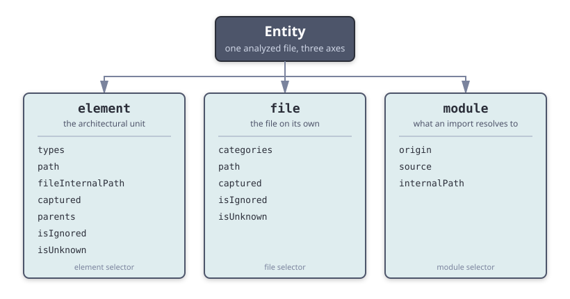
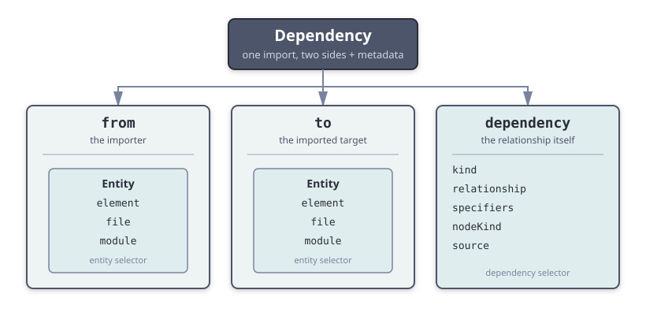

# Selectors

Selectors describe which files and dependencies a rule applies to. You write them in the `from`, `to`, and `dependency` keys of your [policies](../policies/policies.mdx), and the plugin matches them against the [runtime descriptions](../classification/classification.md) it builds for every analyzed file.

There are two top-level selector shapes:

- The **[entity selector](#entity-selectors)** matches **one file** along three independent axes — its [element](./element.md), its [file](./file.md) classification, and the [module](./module.md) it resolves to. You use it in `from` and `to`.
- The **[dependency selector](#dependency-selectors)** matches **one dependency** between two files: `from` (an entity selector), `to` (an entity selector), and `dependency` (the [dependency metadata selector](./dependency.md)).

The smallest selector targets a single axis — for example, one element type:

```js
{ element: { type: "helper" } }
```

That selector matches any file belonging to a `helper` element. You could just as well match a single `file` category or `module` origin instead; no axis takes precedence over the others. From there you can add more conditions to narrow the match.

:::note[Legacy flat selectors]
Earlier versions accepted flat element selectors such as `{ type: "helper" }` (without the `element` wrapper) and bare strings like `"helper"`. They still work and are converted internally, so existing configurations keep running. For new rules, prefer the entity selector form so you can also match against `file` and `module`. The string and tuple formats are documented on the [Legacy Selectors](./legacy/element.md) page.
:::

## How matching works

1. You define [element descriptors](./element.md) and/or [file descriptors](./file.md) in your settings — at least one of the two.
2. During analysis, the plugin builds a [runtime description](../classification/classification.md) for each file: its element, its file categories, and the module it resolves to.
3. Selectors in your rules match against those descriptions to decide whether a rule applies.

All conditions inside a single selector are combined with **AND** — every property you specify must match. Arrays act as **OR** — the selector matches if any item in the array matches. These two rules apply at every level, from sub-selectors down to individual pattern values.

## Entity selectors

An **entity** is the unit the plugin analyzes — one file described along three independent axes. An entity selector lets you match any combination of those axes:



An entity selector has three optional sub-selectors:

```js
{
  element: { /* element sub-selector */ },
  file: { /* file sub-selector */ },
  module: { /* module sub-selector */ }
}
```

- An **omitted** sub-selector matches anything.
- A **present** sub-selector must match for the entity to match.
- Sub-selectors are combined with **AND**: an entity matches only when every provided sub-selector matches.

Each sub-selector has its own reference page:

| Sub-selector | Matches | First-level properties | Reference |
| --- | --- | --- | --- |
| **`element`** | the architectural element the file belongs to | `type`, `types`, `path`, `fileInternalPath`, `captured`, `parent`, `parents`, `isIgnored`, `isUnknown` | [Element selector](./element.md) |
| **`file`** | the file itself, categorized by file descriptors | `categories`, `path`, `captured`, `isIgnored`, `isUnknown` | [File selector](./file.md) |
| **`module`** | the resolved module of a dependency | `origin`, `source`, `internalPath` | [Module selector](./module.md) |

For example, this matches a file that belongs to a `component` element **and** is categorized as a `test` file:

```js
{
  element: { type: "component" },
  file: { categories: "test" }
}
```

You can also provide an **array of entity selectors**, which matches if any of them matches (OR):

```js
// Match components OR helpers
[
  { element: { type: "component" } },
  { element: { type: "helper" } }
]
```

:::note[Legacy]
For backward compatibility, the plugin still accepts element selectors in the old flat format (without the `element` wrapper) as entity selectors. They are converted internally to the entity selector form, so existing configurations keep running. Read the [Legacy Element Selectors](./legacy/element.md) page for details on the old formats and how to migrate to the new entity selector form.
:::

:::tip[Which sub-selector should I use?]
For **local** files, the meaningful classification lives in the `element` and `file` sub-selectors. For **external** and **core** imports, the file usually matches no element, so use the `module` sub-selector.
:::

## Dependency selectors

A dependency selector matches an analyzed dependency between two files. You use it in a [policy](../policies/policies.mdx) to target specific imports and decide whether they are allowed or disallowed:



It has three optional keys:

- **`from`** — [Entity selector(s)](#entity-selectors) matching the importer (the file that has the dependency). Single selector or array (OR).
- **`to`** — [Entity selector(s)](#entity-selectors) matching the imported entity (the file or module being depended on). Single selector or array (OR).
- **`dependency`** — [Dependency metadata selector(s)](./dependency.md) matching properties of the dependency itself (`kind`, `relationship`, `specifiers`, `nodeKind`, `source`). Single selector or array (OR).

```js
// Match dependencies of kind "type" to helpers
{
  to: { element: { type: "helper" } },
  dependency: { kind: "type" }
}

// Match dependencies from components to external "react"
{
  from: { element: { type: "component" } },
  to: { module: { origin: "external", source: "react" } }
}
```

:::tip
Dependency selectors live inside your rule configuration. For how rules use `from`/`to`/`dependency` together with `allow`/`disallow`, see the [Policies documentation](../policies/policies.mdx).
:::

## Combining properties

### AND logic

When a selector object lists several properties, **all** of them must match:

```js
// Element sub-selector: components captured in the "atoms" family
{
  element: {
    type: "component",
    captured: { family: "atoms" }
  }
}

// Entity selector: a component file ALSO categorized as a test file
{
  element: { type: "component" },
  file: { categories: "test" }
}

// Dependency selector: from helpers to components
{
  from: { element: { type: "helper" } },
  to: { element: { type: "component" } }
}
```

### OR logic

There are two ways to express OR.

A **micromatch array** inside one property value matches if any pattern matches:

```js
// Match helpers captured in the "data" OR "permissions" family
{
  element: {
    type: "helper",
    captured: { family: ["data", "permissions"] }
  }
}
```

An **array of selectors** matches if any selector in the array matches. Use this when the alternatives differ in more than one property:

```js
// Match components in the "atoms" family OR any module element
[
  { element: { type: "component", captured: { family: "atoms" } } },
  { element: { type: "module" } }
]
```

The same applies to dependency `to`/`from`:

```js
// Match dependencies from helpers or utilities to either components or modules
{
  from: [
    { element: { type: "helper" } },
    { element: { type: "utility" } }
  ],
  to: [
    { element: { type: "component" } },
    { element: { type: "module" } }
  ]
}
```

## Matching null values

Use `null` to match entities that **do not have a value** for a property. This distinguishes an entity whose property has a specific value from one where the property is absent.

```js
// Match elements with no captured values
{ element: { captured: null } }

// Match elements with no parent
{ element: { parent: null } }
```

:::tip[Matching null values]
Micromatch treats `null` as a non-string value, so a string pattern never matches a `null` value. To match an absent value, write `null` explicitly in your selector. A `null` pattern matches only a `null` value.
:::

## Captured values matching

The `captured` property matches values extracted from file paths by the [`capture`](./element.md) configuration of a descriptor. It is available on the **[`element`](./element.md) and [`file`](./file.md) sub-selectors.**

### Object format (AND logic)

When `captured` is an object, **all** of its keys must match:

```js
// Element descriptor (in boundaries/elements)
{ type: "component", pattern: "components/*/*", capture: ["family", "elementName"] }

// Selector — matches components where family is "atoms" AND elementName is "atom-a"
{
  element: {
    type: "component",
    captured: { family: "atoms", elementName: "atom-a" }
  }
}

// Using micromatch patterns in captured values
{
  element: {
    type: "component",
    captured: { family: "atoms|molecules", elementName: "atom-*" }
  }
}
```

### Array format (OR logic)

When `captured` is an **array of objects**, the entity matches if **any** object matches:

```js
// Match components in the "atoms" OR "molecules" family
{
  element: {
    type: "component",
    captured: [
      { family: "atoms" },
      { family: "molecules" }
    ]
  }
}
```

## Array query selectors

The `types` (element), `categories` (file), and `parents` (element) properties accept an **array query object** that gives you fine-grained control over how the target array is matched, beyond the simple "any element matches" logic of plain pattern strings.

All operators inside the same object are **AND-combined**. An absent operator places no constraint.

| Operator | Shape | Matches when |
| --- | --- | --- |
| `anyOf` | `(string \| { expand: string })[]` | At least one array element matches at least one of the matchers. An empty operand never matches. |
| `allOf` | `(string \| { expand: string })[]` | For every matcher, at least one array element matches it. An empty operand vacuously matches. |
| `noneOf` | `(string \| { expand: string })[]` | No array element matches any of the matchers. An empty operand always matches. |
| `equalsTo` | `(string \| { expand: string })[]` | Array length equals `N` **and** `array[i]` matches `matcher[i]` (ordered, exact length). |
| `atIndex` | `{ index: number; matches: TMatcher \| TMatcher[] }` | Resolves the index (negative counts from end), then that element matches `matches`. When `matches` is an array, OR semantics apply — the element at that index must match at least one of the values. Out-of-range never matches. |
| `hasLength` | `number` | The array length is exactly this value. |

**Rules:**
- When the target array is `null` (unknown/ignored element or file), the entire query returns `false`.
- An empty query object `{}` returns `true` for any non-null array.
- For `equalsTo`, order matters: `["a", "b"]` does not match `["b", "a"]`.
- Negative `atIndex.index` counts from the end: `-1` = last element (e.g. outermost ancestor for `parents`).
- All string matchers are micromatch patterns rendered as Handlebars templates before matching, like all other selector values.

For `types` and `categories`, `TMatcher` is a string (micromatch pattern) or a `{ expand }` item (see [Sourcing operands from a template](#sourcing-operands-from-a-template-expand) below). For `parents`, `TMatcher` is a parent selector object (`type`, `types`, `path`, `category`, `captured`).

```js
// element.types: require exactly one type
{ element: { types: { hasLength: 1 } } }

// element.types: must have "component" but must NOT have "deprecated"
{ element: { types: { allOf: ["component"], noneOf: ["deprecated"] } } }

// file.categories: file has at least two categories
{ file: { categories: { hasLength: 2 } } }

// element.parents: top-level element (no parents)
{ element: { parents: { hasLength: 0 } } }

// element.parents: closest parent (index 0) is a module
{ element: { parents: { atIndex: { index: 0, matches: { type: "module" } } } } }
```

### Sourcing operands from a template (`expand`)

Inside `anyOf`, `allOf`, `noneOf`, and `equalsTo` on **`element.types`**, **`file.categories`**, and **`parent.types`** / **`parents[*].types`**, each item can be either a plain string (micromatch pattern) or a special `{ expand: "{{ path }}" }` object. The `expand` item is resolved at match time against the same template data tree used by `{{ }}` templates and its resolved value is spread in place as additional string matchers.

**Why is this useful?**
When the other side's property is an array (for example `from.element.types` when an element can belong to multiple types), a plain `"{{ from.element.types }}"` template renders the array as the string `"type-a,type-b"`, which is not a valid micromatch OR pattern. The `expand` item reads the **raw array** and spreads each entry as an independent matcher, giving you correct `anyOf` / `noneOf` / `allOf` / `equalsTo` semantics against dynamic values.

**Resolution semantics:**
- The `expand` value must be a single `{{ path }}` expression (e.g. `"{{ from.element.types }}"`).
- If the path resolves to a **string array** → each element becomes a separate matcher.
- If the path resolves to a **scalar string** → a single matcher is produced.
- If the path resolves to **null/undefined**, or the value is not a single `{{ }}` expression → **no matchers** (the item disappears). Combined with the empty-operand rules: empty `noneOf` always passes; empty `anyOf` never matches.

```js
// "to element must share at least one type with the importer"
{
  to: { element: { types: { anyOf: [{ expand: "{{ from.element.types }}" }] } } }
}

// "to element must NOT share any type with the importer"
{
  to: { element: { types: { noneOf: [{ expand: "{{ from.element.types }}" }] } } }
}

// Mixed: also exclude "legacy" in addition to any of the importer's types
{
  to: { element: { types: { noneOf: ["legacy", { expand: "{{ from.element.types }}" }] } } }
}

// "to element must have exactly the same types as the importer (same ordered set)"
{
  to: { element: { types: { equalsTo: [{ expand: "{{ from.element.types }}" }] } } }
}
```

## Templating in selectors

Selector values support templates, so a rule can adapt to the file it is checking. For example, you can disallow a dependency between two elements of the same type but in different families, without writing a rule per family.

:::note
To use a **whole array** from the template tree (e.g. `from.element.types`) as operands of an `anyOf` / `allOf` / `noneOf` / `equalsTo` array query, use the [`{ expand }` item](#sourcing-operands-from-a-template-expand) instead of a plain template string. A plain `"{{ from.element.types }}"` renders as the string `"a,b,c"`, which is not a valid micromatch OR pattern.
:::

The syntax uses Handlebars-style double curly braces. The data tree mirrors the [runtime descriptions](../classification/classification.md), exposing the three entity sub-descriptions on each side:

- **`{{ from.element.* }}`** / **`{{ to.element.* }}`** — element properties such as `{{ from.element.types }}`, `{{ from.element.captured.family }}`, `{{ from.element.path }}`, and `{{ from.element.parents.[0].types.[0] }}`.
- **`{{ from.file.* }}`** / **`{{ to.file.* }}`** — file properties such as `{{ to.file.categories }}`.
- **`{{ from.module.* }}`** / **`{{ to.module.* }}`** — module properties such as `{{ to.module.origin }}` and `{{ to.module.source }}`.
- **`{{ dependency.* }}`** — properties of the dependency itself, such as `{{ dependency.kind }}` and `{{ dependency.specifiers }}`.

:::tip[Accessing array entries]
Use the array index syntax to read a single entry from an array, for example `{{ from.element.types.[0] }}` or `{{ from.element.parents.[0].captured.moduleName }}`.
:::

### Template example

This rule disallows dependencies between elements of the same type that belong to different families:

```js
{
  disallow: {
    to: {
      element: {
        // Match the same element type as the importer...
        type: "{{ from.element.types.[0] }}",
        // ...but a different family
        captured: { family: "!{{ from.element.captured.family }}" }
      }
    },
    dependency: { kind: "value" }
  }
}
```

:::caution
When [`boundaries/legacy-templates`](../settings/settings.md#boundarieslegacy-templates) is enabled (its default), captured values are also injected at the top level of the template data. If a captured value has the same name as a runtime property (for example `path`, `category`, or `origin`), it overwrites that template variable and can cause surprising results. To avoid this, set `boundaries/legacy-templates` to `false` and access captured values only through the `captured` namespace (for example `{{ from.element.captured.path }}`).
:::

:::warning[Legacy template syntax]
The legacy `${ property }` selector syntax is kept for backward compatibility but is deprecated. It is documented, with migration guidance, on the [Legacy templates](./legacy/templates.md) page. Use the modern `{{ property }}` syntax instead.
:::

## Next Steps

- [Element selector](./element.md) — match the element a file belongs to (`type`, `captured`, `parent`...).
- [File selector](./file.md) — match files by category.
- [Module selector](./module.md) — match external and core module imports.
- [Dependency selector](./dependency.md) — match dependency metadata (`kind`, `relationship`...).
- [Classification](../classification/classification.md) — the three layers (element, file, module) that selectors match against.
- [Settings](../settings/settings.md) — configure [`boundaries/files`](../settings/settings.md#boundariesfiles), [`boundaries/elements-single-type`](../settings/settings.md#boundarieselements-single-type), and [`boundaries/legacy-templates`](../settings/settings.md#boundarieslegacy-templates).
- [Policies](../policies/policies.mdx) — use selectors in `from`/`to`/`dependency` together with `allow`/`disallow`.
- [Legacy Selectors](./legacy/element.md) — string and tuple selector formats and how to migrate them.
